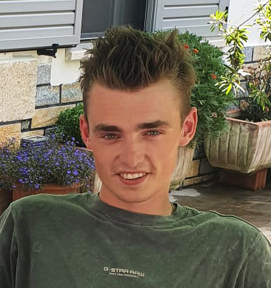

# About

My name is Ruben de Haan and last september 10th I moved from my hometown Rouveen, NL to Barcelona, ES to pursue the MDEF (Master in Design for Emergent Futures) at the Institute for Advanced Architecture of Catalonia. With this website I aim to document my learnings and experiences.

**[my website](https://community.emergentfutures.io/courses/5566525/content)**
